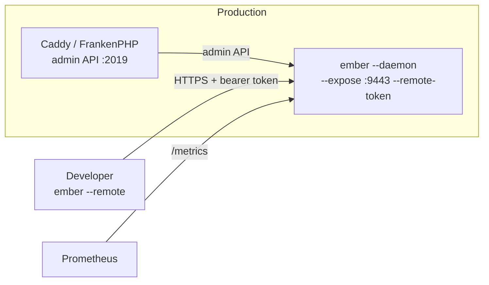

# Remote TUI

Watch a production Caddy/FrankenPHP from your machine with the full TUI, without SSH access to the server, the container or the pod. An Ember daemon runs next to Caddy, as it already does for Prometheus; `ember --remote` connects to it and renders the same dashboard as a local session.



The admin API stays private: only the daemon talks to it. Developers get a token, not a shell.

## Daemon side

```bash
export EMBER_REMOTE_TOKEN=$(openssl rand -hex 32)
ember --daemon --expose :9443 \
      --expose-cert /etc/ember/tls.crt --expose-key /etc/ember/tls.key
```

`--remote-token` (or `EMBER_REMOTE_TOKEN`) turns the remote API on; it is only served in `--daemon` mode. Without it the routes do not exist. The token must be at least 32 characters long.

The same endpoint keeps serving `/metrics` and `/healthz`, still protected by `--metrics-auth` if you set it: the token only opens the `/api/v1/` routes.

### Logs

To relay logs, the daemon receives them from Caddy exactly as the local TUI does: it registers two log sinks in Caddy, enables access logs on the servers that had none, and removes both when it stops. This happens automatically when Caddy is on the same host, or with `--log-listen <addr>` when Caddy must reach the daemon over the network (e.g. `--log-listen ember:9210` in Docker Compose). The daemon keeps the latest 10 000 entries; each remote TUI reads them at its own pace, starting with that backlog. Logs are relayed by single-instance daemons only.

Add `--expose-client-ca /etc/ember/clients-ca.pem` to require a client certificate as well (mTLS). This applies to the whole endpoint, so Prometheus needs a client certificate too.

## Client side

```bash
export EMBER_REMOTE_TOKEN=...   # handed out by the ops team
ember --remote https://ember.prod.example.com:9443
```

TLS verification uses the system trust store; pass `--ca-cert` for a private CA, and `--client-cert` / `--client-key` when the daemon requires mTLS. When the daemon monitors several Caddy instances, pick one with `--remote-instance <name>`.

## What a remote session can do

A remote session only reads snapshots. Everything that would act on production or read its configuration is unavailable:

| Feature | Remote session |
|---------|----------------|
| Caddy tab: hosts, RPS, latency percentiles, status codes | yes |
| FrankenPHP tab: threads, workers, memory | yes |
| Graphs, detail panels, sorting, filtering | yes |
| Logs tab: access and runtime logs, per-host drill-down, By Route | yes, when the daemon collects logs |
| Caddy Config tab, Upstreams configuration | yes, read from the daemon |
| Certificates tab | yes: the PKI CAs and the certificates served on the monitored hosts, dialed by the daemon |
| Worker restart (`r`) | no, reported as not available |
| Plugins | no |

## Security model

- **Transport**: serve the endpoint over TLS, with `--expose-cert`/`--expose-key` or through a TLS-terminating proxy. The daemon logs a warning when the remote API is served over plain HTTP, since the token would travel in clear text.
- **Authentication**: a static bearer token, compared in constant time. Rotating it means restarting the daemon with a new value.
- **Audit**: the daemon logs every rejected request (`remote access denied`), and one line when a remote session opens and closes, with the client address, the client certificate's common name under mTLS, the number of requests and the duration.
- **Least privilege**: the remote API is read-only by construction; no route forwards a write to the Caddy admin API. The certificate route only dials the hosts found in the daemon's own metrics, never hosts named by the client. Those hosts come from the requests Caddy served, the same list the local Certificates tab dials.
- **What the token discloses**: the Caddy config can carry secrets (DNS provider tokens, upstream credentials, hashed passwords), and access logs carry client IPs and request URIs. Hand the token only to people allowed to read both.

## Try it locally

[`local/remote/`](../local/remote/) runs a FrankenPHP whose admin API is not published, and an Ember daemon exposing the remote API over TLS on `:9443`:

```bash
cd local/remote
make up        # generates a self-signed certificate and a token, starts the stack
make traffic   # in another terminal
make start     # the TUI, connected through https://localhost:9443
make logs      # the daemon's audit trail
```

## Limitations

- `--expose-cert` is loaded at startup: SIGHUP reloads the TLS material used to reach Caddy, not this one, so rotating the certificate or the token means restarting the daemon.
- A remote client polls at its own `--interval`; it only renders a new frame when the daemon has polled Caddy since the previous request.
