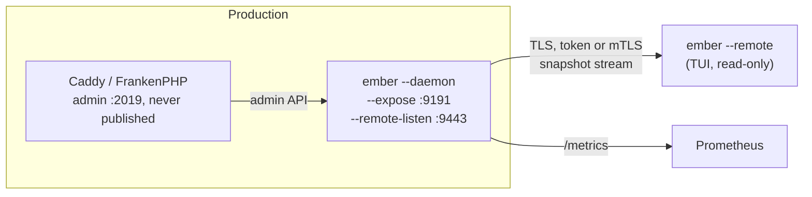

# Remote mode

Remote mode runs the Ember TUI on your workstation against an Ember daemon that runs next to Caddy in production, without SSH access to the machine, the container or the pod. The daemon serves a read-only API on a dedicated TLS listener; the TUI connects to it with a named token or a client certificate.

For the flags see [CLI Reference](cli-reference.md#remote-mode). For the daemon itself see [Prometheus Export](prometheus-export.md#daemon-mode).

## Architecture



The daemon polls Caddy as usual and pushes every poll to the connected TUIs over a Server-Sent Events stream. The remote API and the Prometheus endpoint are separate listeners: `--expose` is unchanged by remote mode and never serves `/remote/`.

## Try it locally

The repo ships a stack at [`local/remote/`](../local/remote/): a FrankenPHP container whose admin API is not published, and an Ember daemon serving the remote API.

```bash
cd local/remote
make up        # generates ./secrets (certificate, token, identities file), then starts the stack
make traffic   # optional: generate some requests
make tui       # ember --remote https://localhost:19443 --remote-ca secrets/daemon.pem --remote-token-file secrets/token
make down
```

## Setting up the daemon

```bash
ember --daemon --expose :9191 --addr http://localhost:2019 \
  --remote-listen :9443 \
  --remote-cert /etc/ember/remote.pem --remote-key /etc/ember/remote-key.pem \
  --remote-auth /etc/ember/remote-auth.toml
```

- `--remote-listen` requires `--daemon`, and must differ from `--expose`.
- TLS is mandatory: TLS 1.2 at least, 1.3 preferred. The daemon refuses to start without `--remote-cert` and `--remote-key`.
- `--remote-insecure-plaintext` serves plain HTTP instead, for a TLS-terminating proxy placed in front of the listener, and logs a warning at startup. Clients then reach the daemon through that proxy only (see [Client](#connecting-the-tui)).
- `--remote-client-ca` requires a client certificate signed by that CA at the TLS handshake (mTLS).
- `--remote-max-sessions` caps simultaneous streams (16 by default); past it the daemon answers 503.

### Identities file

`--remote-auth` points at a TOML file listing who may connect and what they may read. Tokens are stored as SHA-256 digests, never in clear.

```toml
[[token]]
name    = "alice"
sha256  = "9f86d081884c7d659a2feaa0c55ad015a3bf4f1b2b0b822cd15d6c15b0f00a08"
scopes  = ["snapshot"]
expires = 2026-12-31T00:00:00Z  # optional, must carry a UTC offset

[[client_cert]]                 # mTLS identities, with --remote-client-ca only
cn     = "bob"
scopes = ["snapshot"]
```

The file is validated strictly: an unknown key or scope, a duplicate name or digest, a malformed digest, an expiry without offset or an empty file stops the daemon at startup. `[[client_cert]]` entries without `--remote-client-ca` are refused too.

A token is 32 random bytes, base64url-encoded, prefixed with `ember_rt_` so secret scanners can spot a leak. Until a dedicated command exists, generate one and its digest with:

```bash
token="ember_rt_$(openssl rand -base64 32 | tr '+/' '-_' | tr -d '=\n')"
printf '%s' "$token" > alice.token
printf '%s' "$token" | sha256sum | cut -d' ' -f1   # the sha256 value for the file
```

### Scopes

| Scope | Grants | Exposes |
|---|---|---|
| `snapshot` | The snapshot stream; required to connect at all | Hosts, rates, latencies, status codes, upstream health, and the URIs FrankenPHP threads are serving |

The `logs`, `config` and `certificates` scopes are accepted in the file, but this version serves none of them: the matching TUI tabs say so.

### Identity resolution

1. With `--remote-client-ca`, a valid client certificate is required at the TLS level; the handshake fails otherwise.
2. A presented token must be valid, and it decides the identity. A wrong token is refused even when the certificate would have matched.
3. Without a token, the certificate's CN must match a `[[client_cert]]` entry.
4. Neither: 401.

Every refused request gets the same 401 body; the reason only goes to the audit log. After 10 failed attempts within a minute, a source (an IPv4 address, or an IPv6 /64) gets 429 for a minute, valid token or not.

## Connecting the TUI

```bash
ember --remote https://ember.prod.example.com:9443 \
  --remote-ca /etc/ember/prod-ca.pem \
  --remote-token-file ~/.config/ember/prod.token
```

- The token comes from `--remote-token-file` or the `EMBER_REMOTE_TOKEN` variable, never from a command-line argument, which `ps` would show.
- `--remote-ca` verifies the daemon's certificate; without it the system roots apply. `--remote-client-cert` and `--remote-client-key` present a client certificate to a daemon that requires mTLS.
- `--remote-instance` picks the instance on a multi-instance daemon; without it, the TUI lists the names to choose from.
- Only `https://` is accepted, except on a loopback address: the token never crosses a network in clear. Redirects are not followed.
- `--remote` is exclusive with `--daemon`, `--json`, `--expose`, `--stdin-logs` and `--log-listen`. `--addr` and the Caddy TLS flags are ignored with a warning: the daemon's settings apply. The polling interval is the daemon's.

A remote variable exported for another mode is ignored with a warning, so an `EMBER_REMOTE` left in your shell never breaks a local `ember --json` or `ember --daemon`.

### In the TUI

- The header shows a permanent `REMOTE alice@ember.prod.example.com:9443` badge. It turns to the alert colour, with `(disconnected)`, while the stream is down.
- Every tab fed by snapshots works as locally: Caddy hosts, FrankenPHP threads and workers, upstream health, graphs, detail views.
- The session is read-only. `r` on the FrankenPHP tab answers `Worker restart is not available in a remote session (read-only).` instead of asking for confirmation.
- A tab that cannot be served says why, for instance `Logs unavailable: the daemon was not started with --remote-logs.` or `Logs unavailable: your token lacks the "logs" scope.`
- The Upstreams tab shows health, but not the load-balancing columns read from the Caddy config.

### Status and reconnection

The daemon tells the TUI how it sees Caddy:

| State | Meaning | Shown as |
|---|---|---|
| `ok` | The last poll succeeded and its snapshot was sent | Live data |
| `unreachable` | The last poll of Caddy failed | `the daemon cannot reach Caddy since 12:03:04: <error>` |
| `stale` | Polls succeed, but a snapshot could not be sent (for instance larger than the 8 MiB event limit) | `the daemon cannot send snapshots since 12:03:04: <reason>` |

When the stream drops, the TUI reconnects on its own, waiting 1 s, then 2 s, up to 30 s between attempts, and shows `reconnecting to <host>…`. A stream silent for 45 s (three missed pings) counts as dropped. A daemon restart is detected and handled. A refusal that no retry can fix (401, 403, 404, 426) ends the session with its reason instead of retrying, so a revoked token does not trip the daemon's failure limit.

## API

The protocol is versioned (`/remote/v1/`), JSON in UTF-8, and read-only: any method but `GET` and `HEAD` gets 405. Every request must carry `Ember-Remote-Protocol: 1`, or the daemon answers 426 with the versions it supports.

```bash
curl --cacert prod-ca.pem \
  -H "Ember-Remote-Protocol: 1" \
  -H "Authorization: Bearer $(cat prod.token)" \
  https://ember.prod.example.com:9443/remote/v1/info
```

| Route | Scope | Answer |
|---|---|---|
| `GET /remote/v1/info` | any valid identity | Protocol, daemon version and epoch, your identity and scopes, the daemon's capabilities, its instances |
| `GET /remote/v1/stream?instance=<name>` | `snapshot` | `text/event-stream`: `hello`, then `snapshot` and `status` events, with a `: ping` comment every 15 s |

Every non-2xx answer is a JSON body `{"error": "…"}`, with `supportedProtocols` on 426 and `instances` on the 400 of a missing `?instance=`.

## Audit

The daemon logs every session and every refusal as a structured record flagged `audit=true`, on its usual log output (`--log-format json` for aggregation):

| Event | Keys |
|---|---|
| `remote.auth.denied` | `remote_addr`, `reason` (`missing`, `invalid`, `expired`, `rate_limited`, `cert`, `scope`), `user_agent`, `identity`, `client_cn`; plus `source` and `failures` when a block starts |
| `remote.session.open` | `session_id`, `identity`, `client_cn`, `remote_addr`, `instance`, `scopes`, `user_agent`, `ember_version` |
| `remote.session.close` | `session_id`, `identity`, `duration`, `events`, `bytes`, `reason` (`client`, `shutdown`, `slow_client`, `revoked`) |
| `remote.session.refused` | `identity`, `client_cn`, `remote_addr`, `reason` (`session_cap`, `shutdown`) |

No token, digest or config content ever reaches the logs. A rate-limited source is logged once, when its block starts, not on every refused request.

## Threat model

- **What each scope discloses.** `snapshot` exposes the hosts served, their traffic and error rates, upstream health, and the URIs FrankenPHP threads are currently serving, which may carry query strings.
- **No write path.** No route writes to Caddy's admin API: the daemon only reads it, and the remote session cannot restart workers or change the configuration.
- **No SSRF.** The client chooses no address the daemon connects to; it only picks one of the instances the daemon already polls.
- **Revocation.** A token past its `expires` closes the sessions opened with it at their next event, within one ping interval at most. Removing a token from the file takes effect when the daemon restarts, until reloads are supported.
- **Slow or stuck clients** never slow the daemon's polling: each subscriber holds only the latest snapshot, and a client that stops reading for 10 s is disconnected.
- **Behind a proxy** (`--remote-insecure-plaintext`), every request seems to come from the proxy, so the failure limit applies to the proxy's address.

## Not available yet

- Logs, Caddy config and certificates over the remote API.
- Remote endpoints in `.ember.toml`, and a command that generates tokens.
- Reloading the identities file and the certificate on SIGHUP: restart the daemon after a change.
